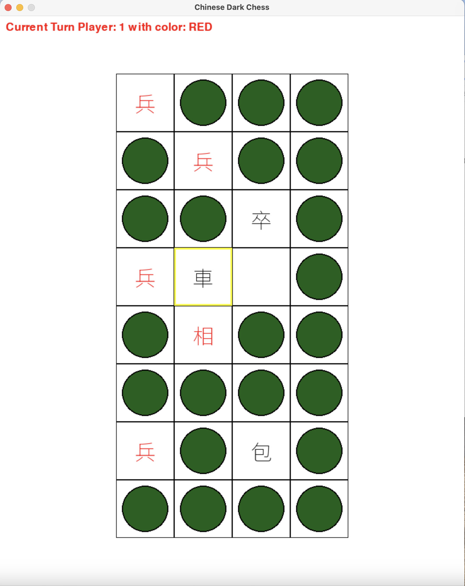

# Chinese_Dark_Chess

This is my play ground to build a Banqi agent.

What is Banqi? Banqi is a traditional board game that is popular in Taiwan. For the play rules, please check [Banqi wiki](https://en.wikipedia.org/wiki/Banqi)


## To Install
```bash
$ cd Chinese_Dark_Chess
$ python3.11 -m venv venv
$ source venv/bin/activate
$ pip install -r requirements.txt
```

## Play with other human
```bash
$(venv) python run.py
```

## Play with AI
TBD

## Train a AI
TBD


## Game need to answer 3 questions
1. What does the board look like?
    ```python
        game.board_state()
    ```
2. What are my legal options?
3. Has the game ended?


## Test
```bash
$(venv) python test_chinese_dark_chess.py
```