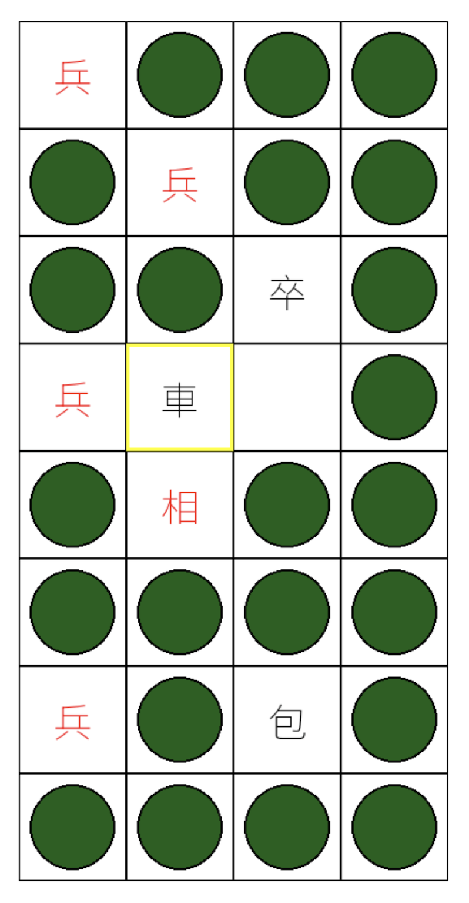

# Chinese_Dark_Chess

This is my play ground to build a Banqi agent.

What is Banqi? Banqi is a traditional board game that is popular in Taiwan. For the play rules, please check [Banqi wiki](https://en.wikipedia.org/wiki/Banqi)


# How to Install
```bash
$ cd Chinese_Dark_Chess
$ python3.11 -m venv venv
$ source venv/bin/activate
$ pip install -r requirements.txt
```

# How to play with other human
```bash
$(venv) python run.py
```

# How to play with AI
TBD

# How to train a AI
TBD